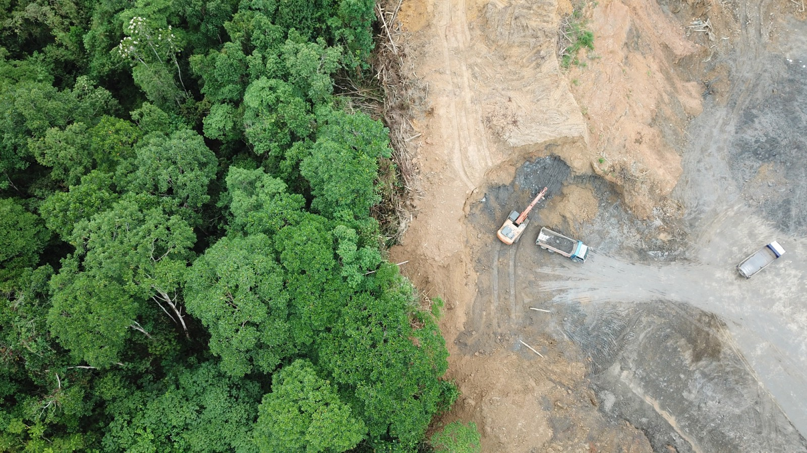

# Global Land Use and Food Consumption Data Analyst

This program is designed to provide insights into global land use patterns and food consumption habits. It covers diverse categories such as the proportion of global land required for agriculture based on national diets, cereal distribution to different uses, and historical data on global land use. This program delivers visual representations showing comparisons and trends across various countries and regions over time. 

## Project Goals

This project was created as a comprehensive resource for exploring the dynamics of land use and food consumption globally. It meets the following project requirements: 

1. **Read and analyze data from multiple CSV files.**
The data sources are three CSV files: "share-of-global-habitable-land-needed-for-agriculture-if-everyone-had-the-diet-of.csv", "global-land-use-since-10000bc.csv", and "cereal-distribution-to-uses.csv". These datasets were chosen to ensure comprehensive coverage of different aspects of land use and food consumption worldwide.

2. **Clean your data and perform a pandas merge with your two data sets, then calculate some new values based on the new data set.**
The project involves the merging of the three CSV files. The datasets are cleaned and preprocessed to ensure data quality and usability.

3. **Make 3 matplotlib or seaborn (or another plotting library) visualizations to display your data.**
Three Seaborn Plots are generated as output. The first visualization shows global trends in different land use categories. The second visualization illustrates land use patterns by region, and the third presents a time-series analysis of cereal distribution to different uses.

4. **Utilize a virtual environment and include instructions in your README on how the user should set one up.**
This project uses Poetry for environment management. However, a traditional VENV can also be used with the included requirements.txt file.

5. **Annotate your .py files with well-written comments and a clear README.md (only applicable if you’re not using a jupyter notebook).**
This README file serves the purpose of providing comprehensive guidance to users. 

## Setup

This program requires two primary steps for setup: setting up a virtual environment and obtaining the datasets.

### Virtual Environment 

#### Via Requirements.txt
1. Clone the Repository to your local device. 
2. Navigate to the project folder with terminal and create a virtual environment.
- Windows
`python -m venv venv`
- Mac/Linux
`python3 -m venv venv`
3. Activate your virtual environment 
- Windows 
`venv\Scripts\activate.bat`
- Mac/Linux
`source venv/bin/activate`
4. Install the requirements.txt file using the following command 
`pip install -r requirements.txt`

### Datasets

The datasets are provided as CSV files in the repository. 

## Running The Program

1. Activate your virtual environment (as described above)
- For Windows: 
`python main.py`
- For Mac/Linux:
`python3 main.py`

2. You'll be asked to input the year you want to analyze.

3. Upon completion, you'll be presented with three data visualizations reflecting various aspects of global land use and food consumption.
